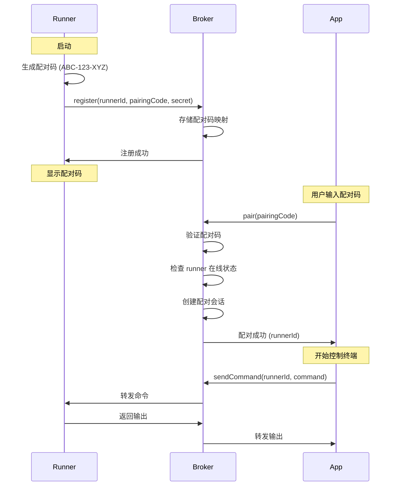
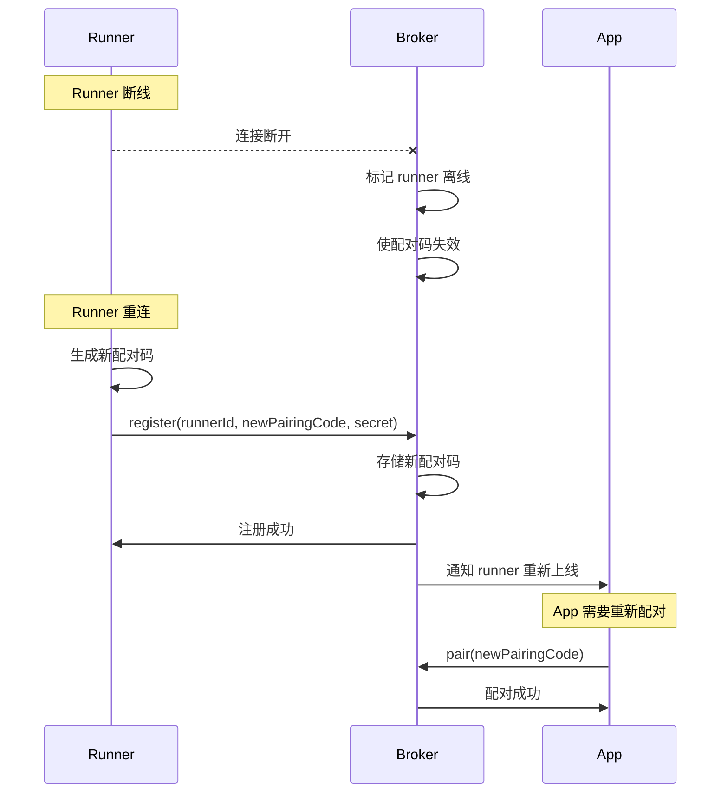

# Design Document: Runner-App Pairing

## Overview

本设计文档描述了远程终端控制系统的配对功能实现方案。该功能允许移动应用（app）通过输入配对码与被控制端服务（runner）建立安全的配对关系，所有配对关系由中间层服务器（broker）管理。

配对流程的核心思想是：
1. Runner 启动时生成唯一的 9 位配对码并注册到 broker
2. App 用户输入配对码向 broker 发起配对请求
3. Broker 验证配对码并建立 app 与 runner 的映射关系
4. 配对成功后，app 可以通过 broker 与 runner 通信

## Architecture

### 系统组件

```
┌─────────────┐         ┌─────────────┐         ┌─────────────┐
│             │         │             │         │             │
│   Runner    │◄───────►│   Broker    │◄───────►│     App     │
│  (Node.js)  │ Socket  │  (NestJS)   │ Socket  │(React Native)│
│             │         │             │         │             │
└─────────────┘         └─────────────┘         └─────────────┘
      │                       │                       │
      │                       │                       │
   生成配对码              管理配对关系            输入配对码
   注册到broker            验证和转发              发起配对请求
```

### 配对流程



### 断线重连流程



## Components and Interfaces

### 1. Runner 组件

**职责：**
- 生成唯一的配对码
- 向 broker 注册配对码
- 在控制台显示配对码
- 处理来自 app 的终端命令

**接口：**

```typescript
// Runner 配置
interface RunnerConfig {
  runnerId: string;
  secret: string;
  brokerUrl: string;
}

// 配对码生成器
class PairingCodeGenerator {
  /**
   * 生成 9 位配对码
   * @returns 格式为 XXX-XXX-XXX 的配对码
   */
  generate(): string;
  
  /**
   * 验证配对码格式
   * @param code 待验证的配对码
   * @returns 是否符合格式要求
   */
  validate(code: string): boolean;
}

// Runner 客户端
class RunnerClient {
  private socket: Socket;
  private pairingCode: string;
  private config: RunnerConfig;
  
  /**
   * 连接到 broker 并注册
   */
  async connect(): Promise<void>;
  
  /**
   * 生成并注册配对码
   */
  private async registerPairingCode(): Promise<void>;
  
  /**
   * 在控制台显示配对码
   */
  private displayPairingCode(): void;
  
  /**
   * 处理断线重连
   */
  private handleReconnect(): void;
}
```

**Socket.io 事件（Runner 发送）：**
- `runner:register` - 注册 runner 和配对码
  ```typescript
  {
    runnerId: string;
    pairingCode: string;
    secret: string;
  }
  ```

**Socket.io 事件（Runner 接收）：**
- `runner:register:success` - 注册成功
- `runner:register:error` - 注册失败
  ```typescript
  {
    error: string;
    code: 'DUPLICATE_CODE' | 'INVALID_SECRET' | 'INVALID_FORMAT';
  }
  ```

### 2. Broker 组件

**职责：**
- 管理配对码注册表
- 验证配对请求
- 管理配对会话
- 实施速率限制
- 记录配对历史

**数据结构：**

```typescript
// 配对码注册信息
interface PairingCodeEntry {
  code: string;
  runnerId: string;
  createdAt: Date;
  expiresAt: Date;
  usedCount: number;
  isActive: boolean;
}

// 配对会话
interface PairingSession {
  appSessionId: string;
  runnerId: string;
  pairedAt: Date;
  isActive: boolean;
}

// 速率限制记录
interface RateLimitEntry {
  appSessionId: string;
  failedAttempts: number;
  lastAttemptAt: Date;
  bannedUntil: Date | null;
}

// 配对历史记录
interface PairingHistoryEntry {
  timestamp: Date;
  appSessionId: string;
  runnerId: string | null;
  pairingCode: string;
  success: boolean;
  errorCode?: string;
}
```

**核心服务：**

```typescript
// 配对码管理服务
class PairingCodeService {
  constructor(private redis: Redis) {}
  
  /**
   * 注册新的配对码（使用 Redis SETNX 保证原子性）
   * @throws Error 如果配对码已存在
   */
  async registerCode(code: string, runnerId: string): Promise<void> {
    // 使用 Redis SETNX 命令保证原子性
    // 如果 key 已存在，SETNX 返回 0，注册失败
    const key = `pairing:code:${code}`;
    const success = await this.redis.setnx(key, JSON.stringify({
      runnerId,
      createdAt: Date.now(),
      expiresAt: Date.now() + 24 * 60 * 60 * 1000,
      usedCount: 0,
      isActive: true,
    }));
    
    if (!success) {
      throw new Error('DUPLICATE_CODE');
    }
    
    // 设置过期时间（24小时）
    await this.redis.expire(key, 24 * 60 * 60);
    
    // 创建反向索引：runnerId -> code
    await this.redis.set(`pairing:runner:${runnerId}`, code);
  }
  
  /**
   * 验证配对码是否有效
   */
  async validateCode(code: string): Promise<{
    valid: boolean;
    runnerId?: string;
    error?: string;
  }> {
    const key = `pairing:code:${code}`;
    const data = await this.redis.get(key);
    
    if (!data) {
      return { valid: false, error: 'CODE_NOT_FOUND' };
    }
    
    const entry: PairingCodeEntry = JSON.parse(data);
    
    if (!entry.isActive) {
      return { valid: false, error: 'CODE_EXPIRED' };
    }
    
    if (Date.now() > entry.expiresAt) {
      await this.invalidateCode(code);
      return { valid: false, error: 'CODE_EXPIRED' };
    }
    
    return { valid: true, runnerId: entry.runnerId };
  }
  
  /**
   * 使配对码失效
   */
  async invalidateCode(code: string): Promise<void> {
    const key = `pairing:code:${code}`;
    await this.redis.del(key);
  }
  
  /**
   * 根据 runnerId 查找配对码
   */
  async findCodeByRunnerId(runnerId: string): Promise<string | null> {
    return await this.redis.get(`pairing:runner:${runnerId}`);
  }
  
  /**
   * 清理过期的配对码（由 Redis TTL 自动处理）
   */
  async cleanupExpiredCodes(): Promise<void> {
    // Redis 会自动清理过期的 key，无需手动清理
  }
}

// 配对会话管理服务
class PairingSessionService {
  constructor(private redis: Redis) {}
  
  /**
   * 创建配对会话
   */
  async createSession(appSessionId: string, runnerId: string): Promise<void> {
    const session: PairingSession = {
      appSessionId,
      runnerId,
      pairedAt: new Date(),
      isActive: true,
    };
    
    // 存储 app -> runner 映射
    await this.redis.set(
      `pairing:session:${appSessionId}`,
      JSON.stringify(session)
    );
    
    // 存储 runner -> apps 映射（使用 Set）
    await this.redis.sadd(`pairing:apps:${runnerId}`, appSessionId);
  }
  
  /**
   * 获取 app 的配对信息
   */
  async getSession(appSessionId: string): Promise<PairingSession | null> {
    const data = await this.redis.get(`pairing:session:${appSessionId}`);
    return data ? JSON.parse(data) : null;
  }
  
  /**
   * 删除配对会话
   */
  async removeSession(appSessionId: string): Promise<void> {
    const session = await this.getSession(appSessionId);
    if (session) {
      // 从 runner 的 app 列表中移除
      await this.redis.srem(`pairing:apps:${session.runnerId}`, appSessionId);
    }
    await this.redis.del(`pairing:session:${appSessionId}`);
  }
  
  /**
   * 获取与指定 runner 配对的所有 app
   */
  async getAppsByRunnerId(runnerId: string): Promise<string[]> {
    return await this.redis.smembers(`pairing:apps:${runnerId}`);
  }
  
  /**
   * 检查 runner 是否在线
   */
  async isRunnerOnline(runnerId: string): Promise<boolean> {
    // 检查 runner 的心跳时间戳
    const heartbeat = await this.redis.get(`runner:heartbeat:${runnerId}`);
    if (!heartbeat) return false;
    
    const lastHeartbeat = parseInt(heartbeat);
    const now = Date.now();
    // 如果超过 30 秒没有心跳，认为离线
    return (now - lastHeartbeat) < 30000;
  }
}

// 速率限制服务
class RateLimitService {
  constructor(private redis: Redis) {}
  
  private readonly MAX_ATTEMPTS = 5;
  private readonly WINDOW_MS = 60000; // 1 分钟
  private readonly BAN_DURATION_MS = 300000; // 5 分钟
  
  /**
   * 检查是否被封禁
   */
  async isBanned(appSessionId: string): Promise<boolean> {
    const banKey = `ratelimit:ban:${appSessionId}`;
    const bannedUntil = await this.redis.get(banKey);
    
    if (!bannedUntil) return false;
    
    const now = Date.now();
    const banExpiry = parseInt(bannedUntil);
    
    if (now >= banExpiry) {
      // 封禁已过期，清理
      await this.redis.del(banKey);
      return false;
    }
    
    return true;
  }
  
  /**
   * 记录失败尝试（使用 Redis 滑动窗口）
   */
  async recordFailedAttempt(appSessionId: string): Promise<void> {
    const key = `ratelimit:attempts:${appSessionId}`;
    const now = Date.now();
    
    // 使用 Redis Sorted Set 实现滑动窗口
    // 添加当前尝试
    await this.redis.zadd(key, now, `${now}`);
    
    // 移除窗口外的旧尝试
    const windowStart = now - this.WINDOW_MS;
    await this.redis.zremrangebyscore(key, 0, windowStart);
    
    // 设置 key 过期时间
    await this.redis.expire(key, Math.ceil(this.WINDOW_MS / 1000));
    
    // 检查窗口内的尝试次数
    const count = await this.redis.zcard(key);
    
    if (count >= this.MAX_ATTEMPTS) {
      // 触发封禁
      const banKey = `ratelimit:ban:${appSessionId}`;
      const bannedUntil = now + this.BAN_DURATION_MS;
      await this.redis.set(banKey, bannedUntil.toString());
      await this.redis.expire(banKey, Math.ceil(this.BAN_DURATION_MS / 1000));
    }
  }
  
  /**
   * 重置计数器（成功配对后）
   */
  async reset(appSessionId: string): Promise<void> {
    const key = `ratelimit:attempts:${appSessionId}`;
    await this.redis.del(key);
  }
  
  /**
   * 获取剩余封禁时间（秒）
   */
  async getRemainingBanTime(appSessionId: string): Promise<number> {
    const banKey = `ratelimit:ban:${appSessionId}`;
    const bannedUntil = await this.redis.get(banKey);
    
    if (!bannedUntil) return 0;
    
    const now = Date.now();
    const banExpiry = parseInt(bannedUntil);
    const remaining = Math.max(0, banExpiry - now);
    
    return Math.ceil(remaining / 1000);
  }
}

// 配对历史服务
class PairingHistoryService {
  constructor(private redis: Redis) {}
  
  private readonly MAX_ENTRIES = 1000;
  private readonly HISTORY_KEY = 'pairing:history';
  
  /**
   * 记录配对事件（使用 Redis List）
   */
  async record(entry: PairingHistoryEntry): Promise<void> {
    // 将事件添加到列表头部
    await this.redis.lpush(
      this.HISTORY_KEY,
      JSON.stringify(entry)
    );
    
    // 保持列表长度不超过 MAX_ENTRIES
    await this.redis.ltrim(this.HISTORY_KEY, 0, this.MAX_ENTRIES - 1);
  }
  
  /**
   * 获取历史记录
   */
  async getHistory(limit: number = 100): Promise<PairingHistoryEntry[]> {
    const data = await this.redis.lrange(
      this.HISTORY_KEY,
      0,
      Math.min(limit, this.MAX_ENTRIES) - 1
    );
    
    return data.map(item => JSON.parse(item));
  }
  
  /**
   * 清理旧记录（由 Redis LTRIM 自动处理）
   */
  private async cleanup(): Promise<void> {
    // Redis LTRIM 在每次 record 时自动执行，无需手动清理
  }
}
```

**WebSocket Gateway：**

```typescript
@WebSocketGateway()
class PairingGateway {
  constructor(
    private pairingCodeService: PairingCodeService,
    private pairingSessionService: PairingSessionService,
    private rateLimitService: RateLimitService,
    private pairingHistoryService: PairingHistoryService,
  ) {}
  
  /**
   * Runner 注册配对码
   */
  @SubscribeMessage('runner:register')
  async handleRunnerRegister(
    @ConnectedSocket() socket: Socket,
    @MessageBody() data: {
      runnerId: string;
      pairingCode: string;
      secret: string;
    }
  ): Promise<void>;
  
  /**
   * App 发起配对请求
   */
  @SubscribeMessage('app:pair')
  async handleAppPair(
    @ConnectedSocket() socket: Socket,
    @MessageBody() data: { pairingCode: string }
  ): Promise<void>;
  
  /**
   * App 查询配对状态
   */
  @SubscribeMessage('app:pairing:status')
  async handlePairingStatus(
    @ConnectedSocket() socket: Socket
  ): Promise<void>;
  
  /**
   * App 解除配对
   */
  @SubscribeMessage('app:unpair')
  async handleUnpair(
    @ConnectedSocket() socket: Socket
  ): Promise<void>;
  
  /**
   * 处理 runner 断开连接
   */
  @OnDisconnect()
  handleRunnerDisconnect(socket: Socket): void;
  
  /**
   * 处理 app 断开连接
   */
  @OnDisconnect()
  handleAppDisconnect(socket: Socket): void;
}
```

**Socket.io 事件（Broker 接收）：**
- `runner:register` - Runner 注册
- `app:pair` - App 配对请求
- `app:pairing:status` - 查询配对状态
- `app:unpair` - 解除配对

**Socket.io 事件（Broker 发送）：**
- `runner:register:success` - Runner 注册成功
- `runner:register:error` - Runner 注册失败
- `app:pair:success` - 配对成功
  ```typescript
  {
    runnerId: string;
    pairedAt: string;
  }
  ```
- `app:pair:error` - 配对失败
  ```typescript
  {
    error: string;
    code: 'INVALID_FORMAT' | 'CODE_NOT_FOUND' | 'CODE_EXPIRED' | 
          'RATE_LIMITED' | 'RUNNER_OFFLINE';
    remainingBanTime?: number; // 仅当 code 为 RATE_LIMITED 时
  }
  ```
- `app:pairing:status:response` - 配对状态响应
  ```typescript
  {
    paired: boolean;
    runnerId?: string;
    runnerOnline?: boolean;
    pairedAt?: string;
  }
  ```
- `app:unpair:success` - 解除配对成功
- `runner:online` - Runner 重新上线通知

### 3. App 组件

**职责：**
- 提供配对码输入界面
- 发起配对请求
- 显示配对状态
- 处理配对错误
- 管理配对会话

**接口：**

```typescript
// App 配置
interface AppConfig {
  brokerUrl: string;
  jwtToken: string;
}

// 配对状态
interface PairingState {
  isPaired: boolean;
  runnerId: string | null;
  runnerOnline: boolean;
  pairedAt: Date | null;
  error: string | null;
}

// App 客户端
class AppClient {
  private socket: Socket;
  private config: AppConfig;
  private pairingState: PairingState;
  
  /**
   * 连接到 broker
   */
  async connect(): Promise<void>;
  
  /**
   * 发起配对请求
   * @param pairingCode 配对码（格式：XXX-XXX-XXX）
   */
  async pair(pairingCode: string): Promise<void>;
  
  /**
   * 查询配对状态
   */
  async getPairingStatus(): Promise<PairingState>;
  
  /**
   * 解除配对
   */
  async unpair(): Promise<void>;
  
  /**
   * 处理断线重连
   */
  private handleReconnect(): void;
  
  /**
   * 处理 runner 重新上线
   */
  private handleRunnerOnline(): void;
}

// React Native UI 组件
interface PairingScreenProps {
  onPairingSuccess: (runnerId: string) => void;
}

class PairingScreen extends React.Component<PairingScreenProps> {
  /**
   * 渲染配对码输入界面
   */
  render(): JSX.Element;
  
  /**
   * 处理配对码输入
   */
  private handlePairingCodeInput(code: string): void;
  
  /**
   * 提交配对请求
   */
  private handleSubmit(): void;
  
  /**
   * 显示错误信息
   */
  private showError(error: string): void;
}
```

**Socket.io 事件（App 发送）：**
- `app:pair` - 配对请求
  ```typescript
  {
    pairingCode: string;
  }
  ```
- `app:pairing:status` - 查询配对状态
- `app:unpair` - 解除配对

**Socket.io 事件（App 接收）：**
- `app:pair:success` - 配对成功
- `app:pair:error` - 配对失败
- `app:pairing:status:response` - 配对状态响应
- `app:unpair:success` - 解除配对成功
- `runner:online` - Runner 重新上线

## Data Models

### 配对码格式

```typescript
// 配对码由 9 个字符组成，分为 3 组，每组 3 个字符
// 字符集：A-Z（26个字母）+ 0-9（10个数字）= 36 个字符
// 总可能性：36^9 = 101,559,956,668,416 (约 101 万亿)
// 碰撞概率：在 10,000 个活跃配对码的情况下，碰撞概率 < 0.00001%

const CHARSET = 'ABCDEFGHIJKLMNOPQRSTUVWXYZ0123456789';
const CODE_LENGTH = 9;
const GROUP_SIZE = 3;
const SEPARATOR = '-';

// 示例：ABC-123-XYZ
```

### 配对码唯一性保证机制

系统通过多层机制保证配对码的唯一性：

#### 1. 统计学唯一性（第一层防护）

配对码使用 36 个字符（26 字母 + 10 数字）的字符集，长度为 9 个字符：
- 总可能性：36^9 ≈ 101 万亿
- 在 10,000 个活跃配对码的情况下，随机碰撞概率 < 0.00001%
- 使用加密安全的随机数生成器（crypto.randomBytes）

```typescript
import crypto from 'crypto';

function generatePairingCode(): string {
  const CHARSET = 'ABCDEFGHIJKLMNOPQRSTUVWXYZ0123456789';
  const CODE_LENGTH = 9;
  
  // 使用加密安全的随机数生成器
  const randomBytes = crypto.randomBytes(CODE_LENGTH);
  
  let code = '';
  for (let i = 0; i < CODE_LENGTH; i++) {
    // 使用模运算确保均匀分布
    code += CHARSET[randomBytes[i] % CHARSET.length];
  }
  
  // 格式化为 XXX-XXX-XXX
  return `${code.slice(0, 3)}-${code.slice(3, 6)}-${code.slice(6, 9)}`;
}
```

#### 2. Redis SETNX 原子性检查（第二层防护）

即使发生统计学上的碰撞，Redis 的 `SETNX` 命令也能保证原子性：

```typescript
async function registerPairingCode(code: string, runnerId: string): Promise<boolean> {
  const key = `pairing:code:${code}`;
  const value = JSON.stringify({
    runnerId,
    createdAt: Date.now(),
    expiresAt: Date.now() + 24 * 60 * 60 * 1000,
  });
  
  // SETNX: SET if Not eXists
  // 返回 1 表示设置成功（key 不存在）
  // 返回 0 表示设置失败（key 已存在）
  const success = await redis.setnx(key, value);
  
  if (success) {
    // 设置 24 小时过期时间
    await redis.expire(key, 24 * 60 * 60);
    return true;
  }
  
  return false;
}
```

#### 3. 重试机制（第三层防护）

如果 Redis 检测到配对码已存在，runner 会自动重新生成并重试：

```typescript
async function registerWithRetry(runnerId: string, maxRetries: number = 3): Promise<string> {
  for (let attempt = 0; attempt < maxRetries; attempt++) {
    const code = generatePairingCode();
    const success = await registerPairingCode(code, runnerId);
    
    if (success) {
      return code;
    }
    
    // 碰撞发生，记录日志并重试
    console.warn(`Pairing code collision detected: ${code}, retrying...`);
  }
  
  throw new Error('Failed to generate unique pairing code after multiple attempts');
}
```

#### 4. 唯一性验证流程

```
Runner 启动
    ↓
生成配对码（使用 crypto.randomBytes）
    ↓
向 Broker 发送注册请求
    ↓
Broker 使用 Redis SETNX 尝试注册
    ↓
    ├─ 成功（key 不存在）
    │   ↓
    │   设置 24 小时 TTL
    │   ↓
    │   返回成功
    │
    └─ 失败（key 已存在）
        ↓
        返回 DUPLICATE_CODE 错误
        ↓
        Runner 重新生成配对码
        ↓
        重试（最多 3 次）
```

#### 5. 并发安全性

Redis 的 `SETNX` 是原子操作，即使多个 runner 同时尝试注册相同的配对码，也只有一个能成功：

```
时间线：
t0: Runner A 生成配对码 "ABC-123-XYZ"
t0: Runner B 生成配对码 "ABC-123-XYZ" (极低概率碰撞)
t1: Runner A 执行 SETNX pairing:code:ABC-123-XYZ -> 成功 (返回 1)
t1: Runner B 执行 SETNX pairing:code:ABC-123-XYZ -> 失败 (返回 0)
t2: Runner B 重新生成配对码 "DEF-456-GHI"
t3: Runner B 执行 SETNX pairing:code:DEF-456-GHI -> 成功 (返回 1)
```

#### 6. 配对码生命周期管理

配对码在以下情况下会被释放，允许重用：
- 24 小时未使用自动过期（Redis TTL）
- Runner 断开连接时主动删除
- 配对码失效时清理

这确保了配对码空间不会被耗尽。

### 数据存储

Broker 使用 Redis 存储配对数据，支持水平扩展和持久化：

```typescript
// Redis Key 设计

// 1. 配对码注册表
// Key: pairing:code:{code}
// Value: JSON string of PairingCodeEntry
// TTL: 24 hours
// Example: pairing:code:ABC-123-XYZ

// 2. Runner 到配对码的反向索引
// Key: pairing:runner:{runnerId}
// Value: pairing code string
// Example: pairing:runner:uuid-123 -> "ABC-123-XYZ"

// 3. 配对会话表
// Key: pairing:session:{appSessionId}
// Value: JSON string of PairingSession
// Example: pairing:session:app-uuid-456

// 4. Runner 的已配对 App 列表
// Key: pairing:apps:{runnerId}
// Type: Set
// Members: app session IDs
// Example: pairing:apps:uuid-123 -> {"app-1", "app-2", "app-3"}

// 5. Runner 心跳时间戳
// Key: runner:heartbeat:{runnerId}
// Value: timestamp (milliseconds)
// TTL: 60 seconds
// Example: runner:heartbeat:uuid-123 -> "1704067200000"

// 6. 速率限制 - 失败尝试记录
// Key: ratelimit:attempts:{appSessionId}
// Type: Sorted Set
// Score: timestamp
// Members: attempt IDs
// TTL: 60 seconds
// Example: ratelimit:attempts:app-uuid -> {(1704067200000, "1704067200000")}

// 7. 速率限制 - 封禁记录
// Key: ratelimit:ban:{appSessionId}
// Value: banned until timestamp
// TTL: 300 seconds
// Example: ratelimit:ban:app-uuid -> "1704067500000"

// 8. 配对历史记录
// Key: pairing:history
// Type: List
// Values: JSON strings of PairingHistoryEntry
// Max length: 1000 (auto-trimmed)
```

### Redis 数据结构优势

1. **原子性操作**
   - 使用 `SETNX` 保证配对码唯一性
   - 使用 `ZADD` + `ZREMRANGEBYSCORE` 实现滑动窗口速率限制
   - 使用 `SADD` 管理 runner 的 app 列表

2. **自动过期**
   - 配对码 24 小时自动过期
   - 心跳 60 秒自动过期
   - 速率限制记录自动清理

3. **高性能**
   - 所有操作都是 O(1) 或 O(log N)
   - 支持并发访问
   - 内存高效

4. **持久化**
   - 支持 RDB 和 AOF 持久化
   - Broker 重启后数据不丢失

5. **水平扩展**
   - 支持 Redis Cluster
   - 多个 Broker 实例可以共享同一个 Redis

### 状态转换

```
配对码状态：
ACTIVE (活跃) → EXPIRED (过期)
ACTIVE (活跃) → INVALIDATED (失效，runner 断开)

配对会话状态：
CREATED (已创建) → ACTIVE (活跃)
ACTIVE (活跃) → DISCONNECTED (断开，app 断开但可重连)
ACTIVE (活跃) → TERMINATED (终止，主动解除配对)

速率限制状态：
NORMAL (正常) → WARNED (警告，失败次数 < 5)
WARNED (警告) → BANNED (封禁，失败次数 >= 5)
BANNED (封禁) → NORMAL (正常，封禁时间到期)
```

## Correctness Properties

*属性（Property）是系统在所有有效执行中应该保持为真的特征或行为。属性是人类可读规范与机器可验证正确性保证之间的桥梁。*

### Property 1: 配对码格式正确性
*For any* 生成的配对码，它应该：
- 包含恰好 9 个字符（不包括连字符）
- 仅包含大写字母（A-Z）和数字（0-9）
- 格式化为 XXX-XXX-XXX 形式
- 匹配正则表达式 `^[A-Z0-9]{3}-[A-Z0-9]{3}-[A-Z0-9]{3}$`

**Validates: Requirements 1.1, 1.2, 1.3**

### Property 2: 配对码统计唯一性
*For any* 批量生成的配对码集合（如 10,000 个），集合中不应该存在重复的配对码

**Validates: Requirements 1.4**

### Property 3: 配对码持久性
*For any* runner 实例，在进程生命周期内（包括断线重连），配对码应该保持不变，直到进程退出

**Validates: Requirements 2.3**

### Property 4: 配对请求处理正确性
*For any* 配对请求，broker 应该：
- 验证配对码格式
- 如果格式正确，查找对应的 runner
- 如果找到 runner 且在线，创建配对会话并返回 runner_id
- 如果配对码不存在、已过期或 runner 离线，返回相应的错误码

**Validates: Requirements 3.2, 3.3, 3.4, 3.5**

### Property 5: 配对会话创建和存储
*For any* 成功的配对请求，broker 应该创建并存储配对会话，包含 app session_id 到 runner_id 的映射

**Validates: Requirements 4.1**

### Property 6: Runner 断开使配对码失效
*For any* runner，当它断开连接时，其配对码应该立即失效，后续使用该配对码的配对请求应该失败

**Validates: Requirements 4.2, 9.2**

### Property 7: Runner 重连生成新配对码
*For any* runner，当它重新连接时，应该生成并注册一个与之前不同的新配对码

**Validates: Requirements 4.3, 9.2**

### Property 8: App 断开保留配对关系
*For any* 已配对的 app，当它断开连接后重新连接时（使用相同的 session_id），配对关系应该被恢复（前提是 runner 仍在线）

**Validates: Requirements 4.4, 9.1, 9.5**

### Property 9: 多 App 配对同一 Runner
*For any* runner 和多个 app，所有 app 都应该能够成功与同一个 runner 配对

**Validates: Requirements 4.5**

### Property 10: 配对码时效性
*For any* 配对码，如果超过 24 小时未被使用，它应该自动失效并无法用于配对

**Validates: Requirements 5.2**

### Property 11: 已使用配对码持续有效
*For any* 已被成功使用至少一次的配对码，它应该继续有效直到对应的 runner 断开连接

**Validates: Requirements 5.3**

### Property 12: 配对码失效后清理
*For any* 失效的配对码，它应该从 broker 的配对码注册表中被移除

**Validates: Requirements 5.4, 11.4**

### Property 13: 速率限制封禁
*For any* app session，如果在 1 分钟内配对失败超过 5 次，该 session 应该被封禁 5 分钟，期间所有配对请求都应该被拒绝

**Validates: Requirements 6.1, 6.2**

### Property 14: 失败尝试记录
*For any* 失败的配对尝试，broker 应该记录该事件，包括时间戳、session_id 和尝试的配对码

**Validates: Requirements 6.4**

### Property 15: 配对状态查询正确性
*For any* app 的配对状态查询，broker 应该：
- 如果 app 已配对，返回配对的 runner_id 和 runner 在线状态
- 如果 app 未配对，返回未配对状态
- 验证配对的 runner 是否仍在线

**Validates: Requirements 7.1, 7.2, 7.3, 7.4**

### Property 16: 解除配对效果
*For any* 已配对的 app，当它发送解除配对请求后：
- 配对关系应该被删除
- app 应该无法再向该 runner 发送命令
- runner 的配对码应该保持有效（允许其他 app 配对）

**Validates: Requirements 8.1, 8.2, 8.3**

### Property 17: Runner 重连通知
*For any* runner 重新连接时，所有之前与该 runner 配对的 app 应该收到 runner 重新上线的通知

**Validates: Requirements 9.3**

### Property 18: 旧配对码失效
*For any* runner 重连后，使用旧配对码的配对请求应该失败

**Validates: Requirements 9.4**

### Property 19: 配对码唯一性检查
*For any* 新的配对码注册请求，如果配对码已存在于注册表中，broker 应该拒绝注册

**Validates: Requirements 11.1, 11.2**

### Property 20: 配对历史记录
*For any* 配对事件（成功或失败），broker 应该记录该事件，包括时间戳、app session_id、runner_id（如果成功）、配对码和结果

**Validates: Requirements 12.1, 12.2**

### Property 21: 配对历史容量限制
*For any* 配对历史记录集合，当记录数超过 1000 条时，最旧的记录应该被删除，保持总数不超过 1000

**Validates: Requirements 12.3, 12.4**


## Error Handling

### 错误码定义

系统使用标准化的错误码来表示不同的错误情况：

```typescript
enum PairingErrorCode {
  // 配对码相关错误
  INVALID_FORMAT = 'INVALID_FORMAT',           // 配对码格式不正确
  CODE_NOT_FOUND = 'CODE_NOT_FOUND',           // 配对码不存在
  CODE_EXPIRED = 'CODE_EXPIRED',               // 配对码已过期
  DUPLICATE_CODE = 'DUPLICATE_CODE',           // 配对码重复（注册时）
  
  // Runner 相关错误
  RUNNER_OFFLINE = 'RUNNER_OFFLINE',           // Runner 离线
  INVALID_SECRET = 'INVALID_SECRET',           // Runner secret 验证失败
  
  // 速率限制错误
  RATE_LIMITED = 'RATE_LIMITED',               // 超过速率限制，被临时封禁
  
  // 会话相关错误
  SESSION_NOT_FOUND = 'SESSION_NOT_FOUND',     // 会话不存在
  NOT_PAIRED = 'NOT_PAIRED',                   // App 未配对
  
  // 网络错误
  NETWORK_ERROR = 'NETWORK_ERROR',             // 网络连接错误
  TIMEOUT = 'TIMEOUT',                         // 请求超时
}
```

### 错误响应格式

所有错误响应遵循统一的格式：

```typescript
interface ErrorResponse {
  success: false;
  error: {
    code: PairingErrorCode;
    message: string;
    details?: any;  // 可选的额外信息
  };
}

// 示例：速率限制错误
{
  success: false,
  error: {
    code: 'RATE_LIMITED',
    message: 'Too many failed attempts. Please try again later.',
    details: {
      remainingBanTime: 245  // 剩余封禁时间（秒）
    }
  }
}
```

### 错误处理策略

#### Runner 端错误处理

1. **注册失败**
   - 如果配对码重复，重新生成配对码并重试
   - 如果 secret 验证失败，记录错误并退出
   - 如果网络错误，使用指数退避重试

2. **连接断开**
   - 自动重连，保持相同的配对码
   - 重连成功后，重新注册配对码
   - 如果多次重连失败，记录错误并通知用户

#### Broker 端错误处理

1. **配对请求验证失败**
   - 返回具体的错误码和用户友好的错误消息
   - 记录失败尝试到历史记录
   - 更新速率限制计数器

2. **Runner 断开**
   - 立即使配对码失效
   - 清理相关的配对会话
   - 通知已配对的 app（如果它们在线）

3. **内存溢出保护**
   - 定期清理过期的配对码
   - 限制配对历史记录数量
   - 清理长时间未活动的速率限制记录

#### App 端错误处理

1. **配对失败**
   - 显示用户友好的错误消息
   - 如果是格式错误，提示用户检查输入
   - 如果是速率限制，显示剩余等待时间
   - 提供重试选项

2. **Runner 离线**
   - 显示 runner 离线状态
   - 提供刷新选项
   - 考虑自动重试（带退避）

3. **网络错误**
   - 显示网络错误提示
   - 自动重连（使用指数退避）
   - 保持配对状态，重连后恢复

### 错误恢复机制

#### 自动重试策略

```typescript
// 指数退避重试配置
interface RetryConfig {
  maxRetries: number;        // 最大重试次数
  initialDelay: number;      // 初始延迟（毫秒）
  maxDelay: number;          // 最大延迟（毫秒）
  backoffMultiplier: number; // 退避倍数
}

// 默认配置
const DEFAULT_RETRY_CONFIG: RetryConfig = {
  maxRetries: 5,
  initialDelay: 1000,      // 1 秒
  maxDelay: 30000,         // 30 秒
  backoffMultiplier: 2,
};
```

#### 断线重连处理

1. **Runner 重连**
   - 保持 runnerId 不变
   - 生成新的配对码
   - 重新注册到 broker
   - 恢复 PTY 会话

2. **App 重连**
   - 使用相同的 session_id
   - Broker 自动识别并恢复配对关系
   - 验证 runner 是否仍在线
   - 如果 runner 离线，通知 app

### 日志记录

所有错误都应该被记录，包括：
- 时间戳
- 错误类型和错误码
- 相关的 session_id 或 runner_id
- 错误上下文（如配对码、请求参数）
- 堆栈跟踪（对于系统错误）

```typescript
interface ErrorLog {
  timestamp: Date;
  level: 'error' | 'warn';
  code: PairingErrorCode;
  message: string;
  context: {
    sessionId?: string;
    runnerId?: string;
    pairingCode?: string;
    [key: string]: any;
  };
  stack?: string;
}
```

## Testing Strategy

### 测试方法

本系统采用双重测试策略，结合单元测试和基于属性的测试（Property-Based Testing, PBT）：

- **单元测试**：验证特定示例、边缘情况和错误条件
- **属性测试**：验证跨所有输入的通用属性

两种测试方法是互补的，共同提供全面的测试覆盖。

### 测试框架选择

- **Runner (Node.js/TypeScript)**：Jest + fast-check
- **Broker (NestJS)**：Jest + fast-check
- **App (React Native)**：Jest + React Native Testing Library + fast-check

### 属性测试配置

每个属性测试应该：
- 运行至少 100 次迭代（由于随机化）
- 使用注释标签引用设计文档中的属性
- 标签格式：`Feature: runner-app-pairing, Property {number}: {property_text}`

示例：
```typescript
// Feature: runner-app-pairing, Property 1: 配对码格式正确性
test('generated pairing codes should match format XXX-XXX-XXX', () => {
  fc.assert(
    fc.property(fc.constant(null), () => {
      const code = generatePairingCode();
      expect(code).toMatch(/^[A-Z0-9]{3}-[A-Z0-9]{3}-[A-Z0-9]{3}$/);
      expect(code.replace(/-/g, '')).toHaveLength(9);
    }),
    { numRuns: 100 }
  );
});
```

### 测试覆盖范围

#### 1. 配对码生成测试

**单元测试：**
- 测试配对码格式验证函数
- 测试边缘情况（空字符串、特殊字符）

**属性测试：**
- Property 1: 配对码格式正确性
- Property 2: 配对码统计唯一性

#### 2. 配对流程测试

**单元测试：**
- 测试成功配对的完整流程
- 测试配对码不存在的情况
- 测试 runner 离线的情况
- 测试格式错误的配对码

**属性测试：**
- Property 4: 配对请求处理正确性
- Property 5: 配对会话创建和存储
- Property 9: 多 App 配对同一 Runner

#### 3. 配对码生命周期测试

**单元测试：**
- 测试配对码过期（24小时）
- 测试 runner 断开后配对码失效
- 测试配对码清理

**属性测试：**
- Property 3: 配对码持久性
- Property 6: Runner 断开使配对码失效
- Property 10: 配对码时效性
- Property 11: 已使用配对码持续有效
- Property 12: 配对码失效后清理

#### 4. 断线重连测试

**单元测试：**
- 测试 runner 断线重连流程
- 测试 app 断线重连流程
- 测试重连时的配对码更新

**属性测试：**
- Property 7: Runner 重连生成新配对码
- Property 8: App 断开保留配对关系
- Property 17: Runner 重连通知
- Property 18: 旧配对码失效

#### 5. 速率限制测试

**单元测试：**
- 测试 5 次失败后封禁
- 测试封禁期间的请求拒绝
- 测试封禁解除

**属性测试：**
- Property 13: 速率限制封禁
- Property 14: 失败尝试记录

#### 6. 配对状态管理测试

**单元测试：**
- 测试配对状态查询
- 测试解除配对
- 测试配对关系恢复

**属性测试：**
- Property 15: 配对状态查询正确性
- Property 16: 解除配对效果

#### 7. 配对码唯一性测试

**单元测试：**
- 测试重复配对码注册被拒绝
- 测试配对码失效后可重用

**属性测试：**
- Property 19: 配对码唯一性检查

#### 8. 配对历史测试

**单元测试：**
- 测试历史记录格式
- 测试历史记录查询

**属性测试：**
- Property 20: 配对历史记录
- Property 21: 配对历史容量限制

### 集成测试

除了单元测试和属性测试，还需要进行端到端的集成测试：

1. **完整配对流程**
   - Runner 启动 → 生成配对码 → App 输入配对码 → 配对成功 → 发送命令

2. **多客户端场景**
   - 多个 app 同时与一个 runner 配对
   - 验证消息正确路由

3. **断线重连场景**
   - Runner 断线重连
   - App 断线重连
   - 验证配对关系正确恢复或更新

4. **错误场景**
   - 网络错误
   - 超时
   - 验证错误处理和恢复

### 性能测试

1. **负载测试**
   - 模拟 1000+ 并发 runner 注册
   - 模拟 10000+ 并发配对请求
   - 验证系统响应时间和稳定性

2. **内存测试**
   - 长时间运行测试
   - 验证内存泄漏
   - 验证清理机制有效性

3. **配对码碰撞测试**
   - 生成大量配对码（100万+）
   - 验证碰撞率低于 0.001%

### 测试数据生成

使用 fast-check 生成测试数据：

```typescript
// 配对码生成器
const pairingCodeArbitrary = fc.stringOf(
  fc.constantFrom(...'ABCDEFGHIJKLMNOPQRSTUVWXYZ0123456789'),
  { minLength: 9, maxLength: 9 }
).map(s => `${s.slice(0, 3)}-${s.slice(3, 6)}-${s.slice(6, 9)}`);

// Runner ID 生成器
const runnerIdArbitrary = fc.uuid();

// Session ID 生成器
const sessionIdArbitrary = fc.uuid();

// 时间戳生成器
const timestampArbitrary = fc.date({
  min: new Date('2024-01-01'),
  max: new Date('2025-12-31')
});
```

### 测试环境

- **本地开发**：使用 Jest 运行所有测试
- **CI/CD**：在每次提交时运行完整测试套件
- **预发布**：运行性能测试和负载测试

### 测试覆盖率目标

- 代码覆盖率：> 90%
- 分支覆盖率：> 85%
- 属性测试覆盖：所有 21 个属性都有对应的测试
- 错误场景覆盖：所有错误码都有测试用例

## Security Considerations

### 配对码安全性

1. **熵值分析**
   - 字符集大小：36（26 字母 + 10 数字）
   - 配对码长度：9 个字符
   - 总可能性：36^9 ≈ 101 万亿
   - 在 10,000 个活跃配对码的情况下，随机猜中的概率 < 0.00001%

2. **暴力破解防护**
   - 速率限制：1 分钟内最多 5 次失败尝试
   - 临时封禁：5 分钟
   - 即使每分钟尝试 5 次，猜中一个配对码需要约 3800 万年

3. **配对码时效性**
   - 未使用的配对码 24 小时后自动失效
   - 减少攻击窗口期

### 认证和授权

1. **Runner 认证**
   - Runner 注册时需要提供 secret
   - Broker 验证 secret 的有效性
   - 防止未授权的 runner 注册

2. **App 认证**
   - App 连接时需要提供 JWT token
   - Broker 验证 token 的有效性和签名
   - 确保只有授权用户可以配对

3. **配对授权**
   - 只有成功配对的 app 才能向 runner 发送命令
   - Broker 在转发命令前验证配对关系
   - 防止未授权访问

### 数据保护

1. **传输加密**
   - 所有 WebSocket 连接使用 TLS/SSL
   - 防止中间人攻击和数据窃听

2. **敏感数据处理**
   - Runner secret 不应该被记录到日志
   - 配对码在日志中应该被部分遮蔽（如 ABC-***-XYZ）
   - JWT token 不应该被记录

3. **内存安全**
   - 定期清理过期数据
   - 防止内存泄漏导致的敏感信息泄露

### 拒绝服务（DoS）防护

1. **连接限制**
   - 限制单个 IP 的并发连接数
   - 限制单个用户的 runner 注册数量

2. **请求限制**
   - 速率限制配对请求
   - 限制消息大小和频率

3. **资源限制**
   - 限制配对历史记录数量（1000 条）
   - 限制活跃配对会话数量
   - 定期清理过期资源

### 审计和监控

1. **日志记录**
   - 记录所有配对事件（成功和失败）
   - 记录所有认证失败
   - 记录所有速率限制触发

2. **异常检测**
   - 监控异常高的失败率
   - 监控来自同一 IP 的大量请求
   - 监控配对码碰撞

3. **告警机制**
   - 当检测到可疑活动时发送告警
   - 当系统资源使用异常时发送告警

## Implementation Notes

### 技术栈

- **Runner**: Node.js + TypeScript + Socket.io-client
- **Broker**: NestJS + TypeScript + Socket.io + @nestjs/websockets
- **App**: React Native + TypeScript + Socket.io-client

### 依赖库

```json
{
  "dependencies": {
    "socket.io": "^4.6.0",
    "socket.io-client": "^4.6.0",
    "@nestjs/websockets": "^10.0.0",
    "@nestjs/platform-socket.io": "^10.0.0",
    "ioredis": "^5.3.0",
    "@nestjs/redis": "^10.0.0"
  },
  "devDependencies": {
    "jest": "^29.0.0",
    "fast-check": "^3.15.0",
    "@types/jest": "^29.0.0",
    "ioredis-mock": "^8.9.0"
  }
}
```

### Redis 连接配置

```typescript
// Broker Redis 配置
import { Redis } from 'ioredis';

const redisConfig = {
  host: process.env.REDIS_HOST || 'localhost',
  port: parseInt(process.env.REDIS_PORT || '6379'),
  password: process.env.REDIS_PASSWORD,
  db: parseInt(process.env.REDIS_DB || '0'),
  
  // 连接池配置
  maxRetriesPerRequest: 3,
  enableReadyCheck: true,
  enableOfflineQueue: true,
  
  // 重连策略
  retryStrategy: (times: number) => {
    const delay = Math.min(times * 50, 2000);
    return delay;
  },
  
  // 连接超时
  connectTimeout: 10000,
  
  // 命令超时
  commandTimeout: 5000,
};

// 创建 Redis 客户端
const redis = new Redis(redisConfig);

// 错误处理
redis.on('error', (err) => {
  console.error('Redis connection error:', err);
});

redis.on('connect', () => {
  console.log('Redis connected');
});

redis.on('ready', () => {
  console.log('Redis ready');
});
```

### 配置建议

```typescript
// Broker 配置
const BROKER_CONFIG = {
  // 配对码配置
  pairingCode: {
    length: 9,
    expirationHours: 24,
    charset: 'ABCDEFGHIJKLMNOPQRSTUVWXYZ0123456789',
  },
  
  // 速率限制配置
  rateLimit: {
    maxAttempts: 5,
    windowMs: 60000,      // 1 分钟
    banDurationMs: 300000, // 5 分钟
  },
  
  // 历史记录配置
  history: {
    maxEntries: 1000,
  },
  
  // 清理任务配置
  cleanup: {
    intervalMs: 3600000,  // 1 小时
  },
};
```

### 部署考虑

1. **水平扩展**
   - 使用 Redis 作为共享存储，支持多 Broker 实例部署
   - 所有 Broker 实例共享同一个 Redis（或 Redis Cluster）
   - 配对码唯一性由 Redis SETNX 保证，无需分布式锁
   - 可以使用负载均衡器（如 Nginx）分发 WebSocket 连接

2. **持久化**
   - Redis 支持 RDB 和 AOF 持久化
   - Broker 重启后，配对关系自动恢复
   - 建议配置：
     ```
     # Redis 配置
     save 900 1      # 900 秒内至少 1 个 key 变化时保存
     save 300 10     # 300 秒内至少 10 个 key 变化时保存
     save 60 10000   # 60 秒内至少 10000 个 key 变化时保存
     appendonly yes  # 启用 AOF
     appendfsync everysec  # 每秒同步一次
     ```

3. **高可用性**
   - 使用 Redis Sentinel 实现自动故障转移
   - 或使用 Redis Cluster 实现分片和高可用
   - 建议配置：
     - 1 个 Master + 2 个 Replica
     - 3 个 Sentinel 节点

4. **监控**
   - 监控 Redis 连接数和内存使用
   - 监控活跃连接数（runner 和 app）
   - 监控配对成功率和失败率
   - 监控平均响应时间
   - 监控错误率和速率限制触发次数

5. **日志**
   - 使用结构化日志（JSON 格式）
   - 集成日志聚合系统（如 ELK）
   - 设置合适的日志级别
   - 敏感信息（secret, token）不记录到日志

6. **性能优化**
   - 使用 Redis 连接池
   - 启用 Redis Pipeline 批量操作
   - 合理设置 Redis maxmemory 和淘汰策略
   - 使用 Redis 慢查询日志监控性能

## Future Enhancements

1. **配对码自定义**
   - 允许用户自定义配对码格式
   - 支持更短或更长的配对码

2. **配对权限管理**
   - 支持只读配对（只能查看，不能操作）
   - 支持临时配对（限时访问）

3. **配对码分享**
   - 生成配对码的二维码
   - 支持通过链接分享配对码

4. **多因素认证**
   - 配对时需要额外的验证步骤
   - 如短信验证码、邮箱验证

5. **配对通知**
   - 当有新的 app 配对时，通知 runner 管理员
   - 支持配对审批流程

6. **配对分析**
   - 统计配对使用情况
   - 分析配对失败原因
   - 生成配对报告
